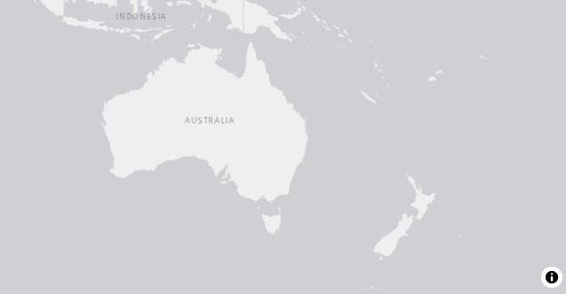
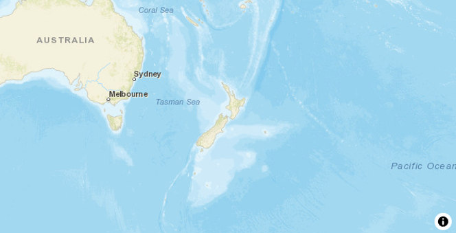
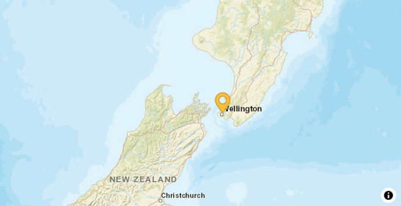

# _toro_ <a href="https://epi-interactive-ltd.github.io/toro/"></a>

<!-- badges: start -->

[](https://github.com/Epi-interactive-Ltd/toro/actions)
[](https://CRAN.R-project.org/package=toro)
<!-- badges: end -->

## Overview

Interactive spatial visualisations are a cornerstone for understanding and communicating complexity in almost all technical and scientific disciplines, as well as being commonly embedded in reports or interactive dashboards. As the amount of data grows, so does the pressure to create timely operational intelligence. Modern high-performance approaches are needed to keep up with this growing demand. MapLibre GL JS is an open-source JavaScript/TypeScript library for rendering interactive maps in the browser, built from the ground up for responsiveness and scale. 

_toro_ provides R bindings to MapLibre GL JS, allowing users to create interactive maps that can easily be integrated into both Quarto and the R Shiny dashboard framework. _toro_ enables spatial visualisation and exploration of data that might otherwise be too limited, too slow, or too hard to scale using traditional tools. _toro_ was created by Epi (link to Epi website).

If you have any comments, questions, or suggestions, please contact us (links to email).

## Why might you want to use _toro_

As a general purpose library with a focus on interactivity and performance, _toro_ maps are ideal for complex data that may be used in web apps, teaching, interactive reports and presentations. Use cases for _toro_ include, but are not limited to:

- **eDNA and biodiversity monitoring:** map sampling sites, species detections, read counts, and habitat layers to spot spatial biodiversity patterns and guide future field sampling. 
- **Ecology and conservation:** visualise telemetry tracks, protected-area boundaries, invasive species records, or restoration sites with interactive layers and clustering. 
- **Environmental modelling:** explore spatial model outputs such as pollution gradients, flood risk, fire exposure, climate surfaces, or watershed indicators. 
- **Mathematical and statistical teaching:** demonstrate spatial clustering, interpolation, coordinate systems, distance metrics, and animated trajectories using live, interactive maps. 
- **Geospatial data analysis:** inspect large coordinate-based datasets, compare map tile contexts, toggle layers, and export reproducible visual outputs for reports or dashboards. 


## Installation

Install from CRAN:

```r
install.packages("toro")
```

Or, install the development version from
[GitHub](https://github.com/Epi-interactive-Ltd/toro):

```r
pak::pak("Epi-interactive-Ltd/toro")
```

Once installed, this package can be used in the R console and within Shiny applications or Quarto reports.


## Getting started

The central function of the package is the `map` function, this creates a `htmlwidget` for interactive use with a base world map layer:

```r
library(toro)
map()
```


Further arguments can be passed to customize the styling of the map:

```r
map(
  style = "streets",
  center = c(174, -41),
  zoom = 2
)
```



From there, tidyverse-style pipelines are used to add various data, via geospatial simple-features objects, to the map in layers:

```r
# A single point made via the sf package
data <- sf::st_as_sf(
  data.frame(lat = c(-41.306579555227245), long = c(174.82263228933076)),
  coords = c("long", "lat"),
  crs = 4326
)

map(
  style = "streets",
  center = c(174, -41),
  zoom = 5
) |>
  add_symbol_layer(
    id = "marker-layer",
    source = data
  )
```



As a `htmlwidget`, all _toro_ maps are supported in any supporting framework, including Shiny, Quarto and more. Maps can further be exported to standalone html files (for further interactive use), or static images can be saved:

```r
map(
  style = "streets",
  center = c(174, -41),
  zoom = 2
) |>
  add_symbol_layer(
    id = "marker-layer",
    source = data
  ) |>
  export_map_image("map.png")
```

## Where to next?

The [layers vignette](https://epi-interactive-ltd.github.io/toro/articles/layers.html), details the different kinds of data that can be plotted and their different configurations. For styling the underlying base map, please see the [map tiles vignette](https://epi-interactive-ltd.github.io/toro/articles/map-tiles.html). Users interested in integration with Shiny apps should see the integration with [Shiny vignette](https://epi-interactive-ltd.github.io/toro/articles/shiny-integration.html), which responsive and dynamic visualization in dashboard contexts.