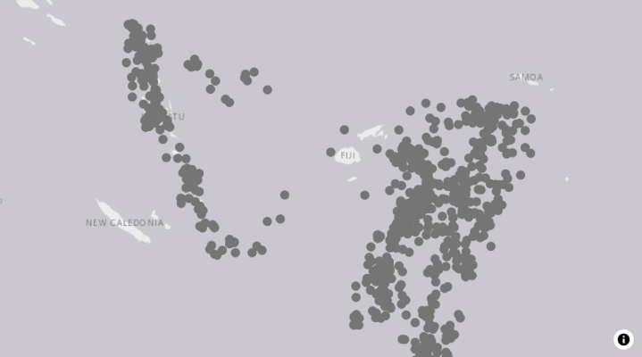
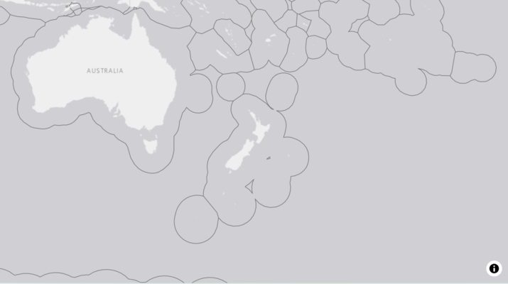
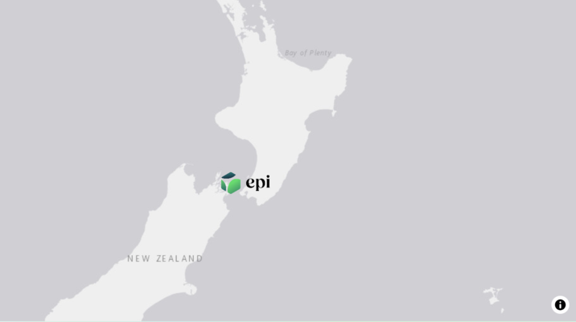
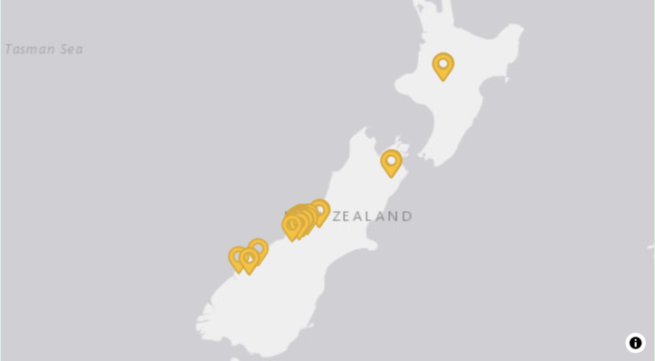
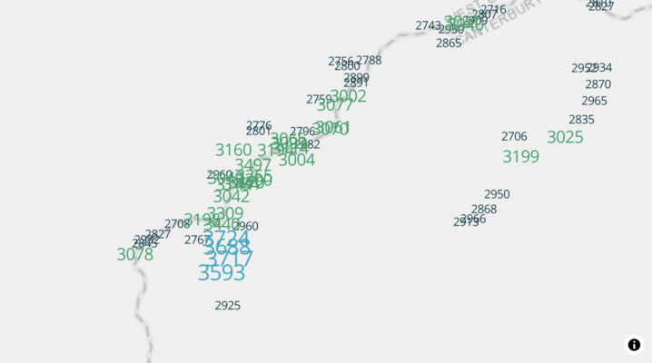
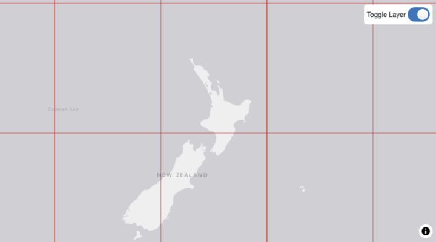
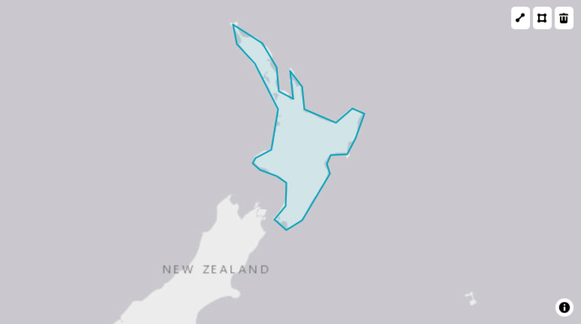

# All Examples

Welcome to the toro examples gallery! These interactive examples
demonstrate how to create powerful map visualizations using toro.

Use the navigation menu on the left to explore all available examples,
or click the links below to jump to specific examples:

## Sources

Sources are required to add data to your map.

### [Add a GeoJSON source](https://epi-interactive-ltd.github.io/toro/articles/examples/sources/add-geojson-source.md)

Description goes here

### [Add a feature service source](https://epi-interactive-ltd.github.io/toro/articles/examples/sources/add-feature-service-source.md)

Description goes here

### [Add an image source](https://epi-interactive-ltd.github.io/toro/articles/examples/sources/add-image-source.md)

Description goes here

------------------------------------------------------------------------

## Layers

### [Add a fill layer](https://epi-interactive-ltd.github.io/toro/articles/examples/layers/add-fill-layer.md)

Description goes here

### [Add a line layer](https://epi-interactive-ltd.github.io/toro/articles/examples/layers/add-line-layer.md)

Description goes here

### [Add a circle layer](https://epi-interactive-ltd.github.io/toro/articles/examples/layers/add-circle-layer.md)

Description goes here

### [Add a symbol layer](https://epi-interactive-ltd.github.io/toro/articles/examples/layers/add-symbol-layer.md)

Description goes here

### [Add a text layer](https://epi-interactive-ltd.github.io/toro/articles/examples/layers/add-text-layer.md)

Description goes here

#### [Latitude and Longitude Grid](https://epi-interactive-ltd.github.io/toro/articles/examples/layers/lat-lng-grid.md)

Description goes here

## Controls

#### [Draw Control](https://epi-interactive-ltd.github.io/toro/articles/examples/controls/draw-control.md)

Description goes here
