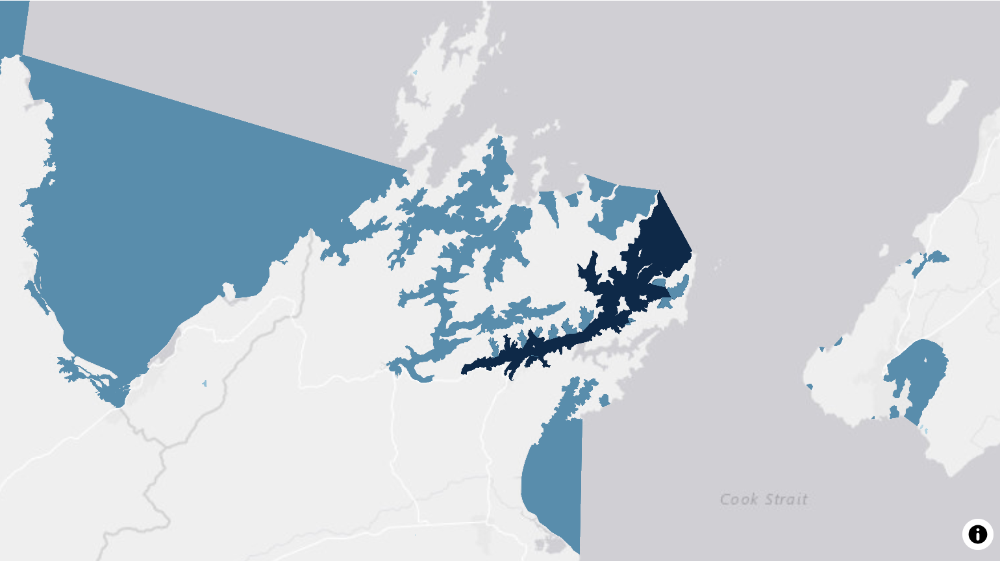
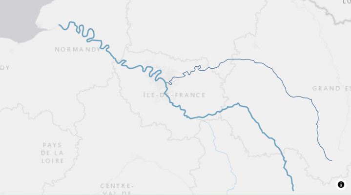
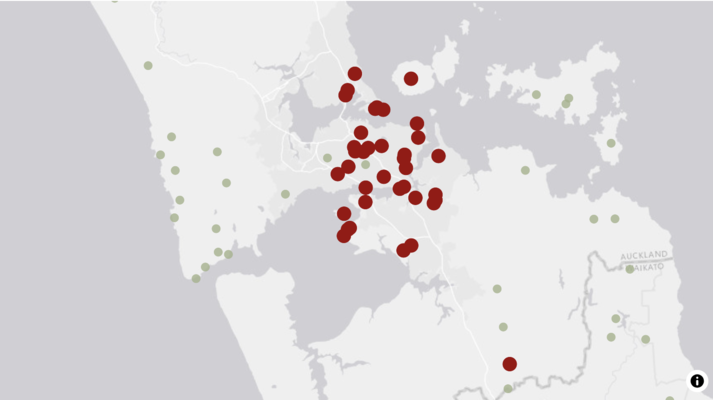

```{r, echo = FALSE}
knitr::opts_chunk$set(fig.path = "man/figures/")
```

Welcome to the toro examples gallery! These interactive examples demonstrate how to create powerful map visualizations using toro.

Use the navigation menu on the left to explore all available examples, or click the links below to jump to specific examples:

# Sources

Sources are required to add data to your map.

## [Add a GeoJSON source](sources/add-geojson-source.html)

## [Add a feature service source](sources/add-feature-service-source.html)

## [Add an image source](sources/add-image-source.html)

---

# Layers

## [Add a fill layer](layers/add-fill-layer.html)



## [Add a line layer](layers/add-line-layer.html)



## [Add a circle layer](layers/add-circle-layer.html)



## [Add a symbol layer](layers/add-symbol-layer.html)


## [Add a text layer](layers/add-text-layer.html)


### [Latitude and Longitude Grid](layers/lat-lng-grid.html)


---
